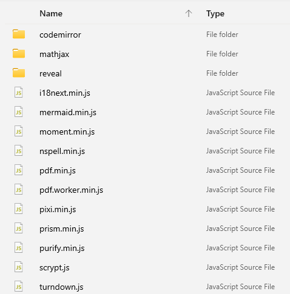

# What is used in Obsidian?
- [TypeScript](https://github.com/microsoft/TypeScript) compiled to pure JavaScript, no frameworks[^1]
- [Electron](https://github.com/electron/electron): cross-platform desktop app using web technologies
- [Capacitor](https://github.com/ionic-team/capacitor): cross-platform mobile apps using web technologies[^2]
- [CodeMirror](https://github.com/codemirror/CodeMirror): notes editor
- [Moment.js](https://github.com/moment/moment): date library for parsing, validating, manipulating, and formatting dates
- [Pixi.js](https://github.com/pixijs/pixijs): rendering graph view
- [D3.js](https://github.com/d3/d3): graph view simulation
- [nspell](https://github.com/wooorm/nspell): spell checking
- [DOMPurify](https://github.com/cure53/DOMPurify): XSS sanitizer
- [i18next](https://github.com/i18next/i18next): internalization
- [scrypt.js](https://github.com/ricmoo/scrypt-js): encryption for Obsidian Sync[^3]
- [Turndown](https://github.com/mixmark-io/turndown): HTML into Markdown
- [MathJax](https://github.com/mathjax/MathJax): display engine for mathematics
- [mermaid](https://github.com/mermaid-js/mermaid): diagramming and charting
- [Prism](https://github.com/PrismJS/prism): syntax highlighting
- [pdf.js](https://github.com/mozilla/pdf.js): PDF viewer
- [reveal.js](https://github.com/hakimel/reveal.js): presentations

[^1]: https://discord.com/channels/686053708261228577/694233507500916796/712771272039202898
[^2]: https://discord.com/channels/686053708261228577/864046194195431425/864065699857170442
[^3]: https://help.obsidian.md/Licenses+%26+add-on+services/Obsidian+Sync#Is+the+end-to-end+encryption+strong